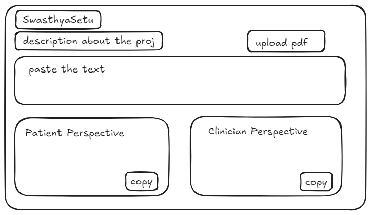

# SwasthyaSetu
swasthya setu is Medical discussion summarizer (between patient and doctor) that gives patient and clinician perspective with using preexisting llm's apis. we will parse the text and generate summary from scratch

**Patient Perspective**: Simplified, accessible language for patients and caregivers
**Clinician Perspective**: Technical, detailed summaries for healthcare professionals
# [For PPT Please refer to this](https://drive.google.com/file/d/1mY2UF8aKJeMcgcr5V-MCq6zBKnW419LX/view?usp=sharing)
# [For Video refer to this link](https://drive.google.com/file/d/1XEKvb-fKllULbcUmub_d4r5oih15WinW/view?usp=sharing)

## AI Model 
- transformer encoder-decoder architecture ( 10 to 30 million) parameters
- Dual mode generation --> clinician and patient (caregivers)
<!-- - Info, sugestion, experience, question, cause. -->
- copy mechanism for preserving medical terms
- Provenence tracking -- which part of input text support the summary
- faithfullness score- to measure reliability.
- ONNX runtime - light weight inference on cpu, even in browser

## [Research based](https://arxiv.org/pdf/2406.08881) 
- **Plasma architecture: given latest research paper.
- Runs NLP preprocessing (tokenization, entity recognition, perspective tagging).

## Tech stack
- fastapi backend - rest api
- react frontend -  
- SQLite database
- Docker deployment so that users can easily fork the repo and modify this.
- ONNX export ( optimised model inference for production)

## Features
- pdf export using jsPDF, 

## Workflow Diagram

```
┌─────────────────┐    ┌─────────────────┐    ┌─────────────────┐
│   React Frontend │    │  FastAPI Backend │    │  MySQL Database │
│                 │    │                 │    │                 │
│ • Authentication│◄──►│ • REST API      │◄──►│ • User Data     │
│ • Summarization │    │ • JWT Auth      │    │ • Summaries     │
│ • History       │    │ • Model Serving │    │ • Feedback      │
│ • Export        │    │ • ONNX Runtime  │    │ • Analytics     │
└─────────────────┘    └─────────────────┘    └─────────────────┘
                                │
                                ▼
                       ┌─────────────────┐
                       │   AI Model      │
                       │                 │
                       │ • Transformer   │
                       │ • Perspective   │
                       │ • Copy Mechanism│
                       │ • ONNX Export   │
                       └─────────────────┘
```